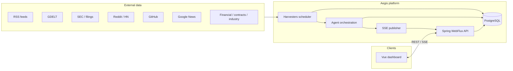
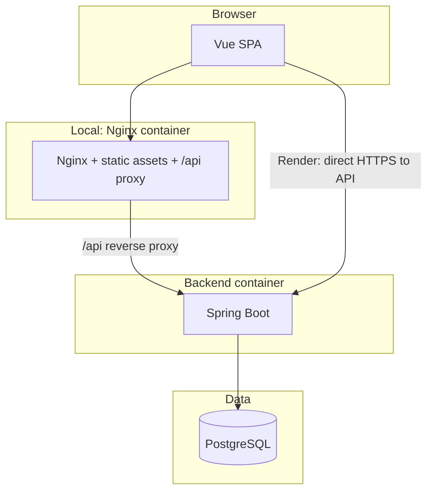
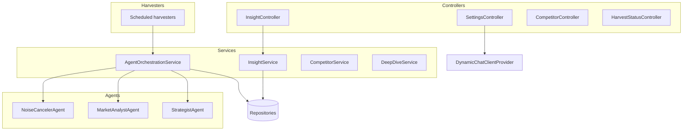
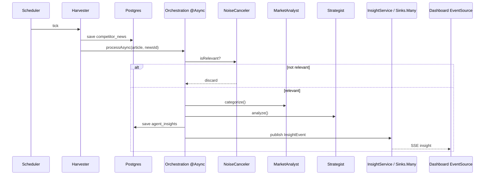
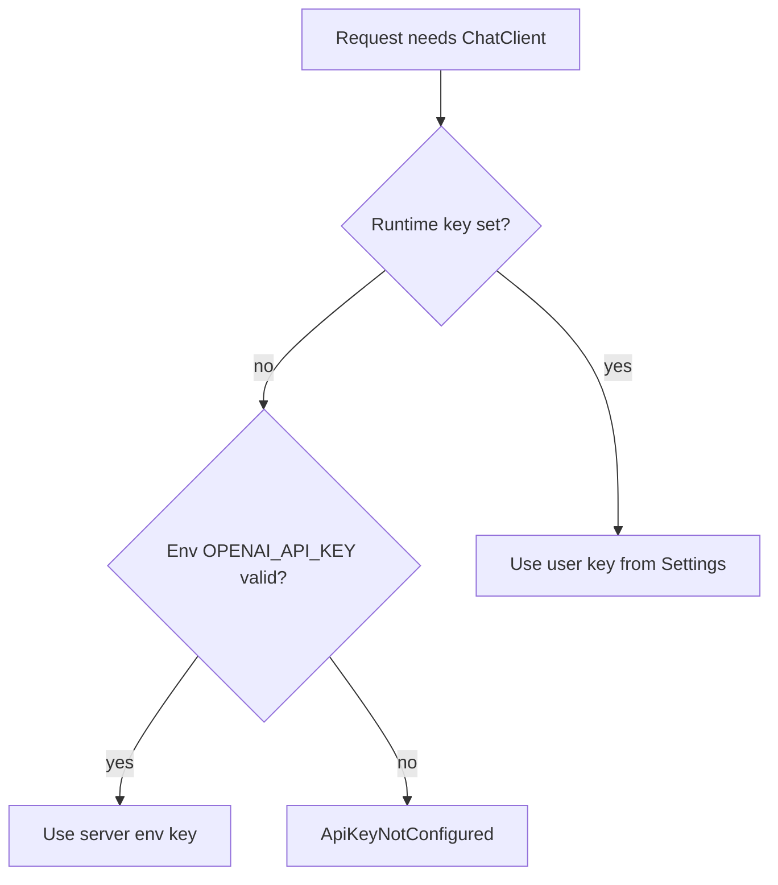

# Aegis Intelligence Engine

Real-time **competitor intelligence** platform: scheduled harvesters pull public market signals, a **three-stage Spring AI pipeline** filters and interprets them, and a **Vue 3** dashboard consumes insights via **Server-Sent Events (SSE)** and REST.

---

## Table of contents

- [Problem and outcome](#problem-and-outcome)
- [Project scope](#project-scope)
- [What this project demonstrates](#what-this-project-demonstrates)
- [Tech stack](#tech-stack)
- [Architecture](#architecture)
- [Data and control flows](#data-and-control-flows)
- [Repository structure](#repository-structure)
- [Environment variables](#environment-variables)
- [Quick start](#quick-start)
- [API surface](#api-surface)
- [Data model](#data-model)
- [Development and testing](#development-and-testing)
- [Operational notes](#operational-notes)
- [Deploy on Render](#deploy-on-render)
- [Future enhancements](#future-enhancements)

---

## Problem and outcome

**Problem:** Product, strategy, and marketing teams need a single place to watch **competitive moves** (launches, hiring, partnerships, filings) without drowning in raw feeds.

**Outcome:** Aegis **collects** heterogeneous sources into one schema, **reduces noise** with an LLM gate, **classifies and scores** threat, and **streams** results so operators see high-signal updates as they land—not after manual refresh.

---

## Project scope

### In scope

| Area | Description |
|------|-------------|
| **Ingestion** | Scheduled harvesters (RSS, GDELT, Reddit, Hacker News, SEC EDAR/EDGAR-style search, GitHub, Google News, financial/contract/industry feeds per `application.yml`). |
| **Persistence** | Raw articles in PostgreSQL; Flyway-managed schema. |
| **AI pipeline** | Noise canceler → market analyst (category) → strategist (threat 1–10 + advice); failures never break the chain. |
| **Realtime UX** | SSE insight stream + REST for history, threats, deep-dive, competitors, harvest status, settings. |
| **Configuration** | Env-based DB, OpenAI key (server + optional user override in UI), tracked competitors. |
| **Local run** | Docker Compose (Postgres + API + Nginx SPA). |
| **Cloud run** | Render blueprint (`render.yaml`): API + static site; **Neon** for Postgres. |

### Out of scope (current release)

| Area | Notes |
|------|--------|
| **Multi-tenant auth** | No built-in user accounts or RBAC; suitable for internal/single-team or demo. |
| **SLA / HA** | Single API instance; no horizontal scaling story in-repo. |
| **Source connectors as products** | New sources require code changes (harvester + config), not plug-in marketplace. |
| **Long-term secret store** | User-saved OpenAI keys are runtime/in-browser patterns; server key via env is the durable default for production. |

### Boundaries and assumptions

- **OpenAI** is the configured LLM provider (Spring AI); agents degrade safely if the key is missing.
- **CORS** is configurable via `AEGIS_CORS_ALLOWED_ORIGINS` (comma-separated patterns) for split-origin deploys (e.g. static site + API).
- **Legal / ToS** of each external source are the operator’s responsibility; URLs and cadences live in configuration.

---

## What this project demonstrates

- Full-stack **Java 21 + Spring Boot 3.4 (WebFlux)** with **Vue 3 + Vite + TypeScript**
- **SSE-first** UI instead of polling-only dashboards
- **Agent-shaped** orchestration with isolated `@Service` agents and safe fallbacks
- **Contract alignment**: Java records ↔ TypeScript interfaces
- **Infrastructure**: Docker Compose locally; **Blueprint** for Render (Postgres + API + static site)

---

## Tech stack

| Layer | Technology |
|-------|------------|
| Backend | Java 21, Spring Boot 3.4, WebFlux, Spring AI (OpenAI), `@Async` orchestration |
| Data | PostgreSQL 16, Spring Data JPA, Flyway |
| Frontend | Vue 3 (`<script setup lang="ts">`), Vite, Pinia, Tailwind CSS |
| Realtime | `Flux<ServerSentEvent<T>>`, Pinia + `useSse.ts` (`EventSource`) |
| Local infra | Docker Compose, Nginx (frontend container proxies `/api` to backend) |
| Cloud | Render (`render.yaml`) + Neon Postgres |
| Testing | JUnit 5 + AssertJ + Mockito; Vitest; Playwright (e2e) |

---

## Architecture

### High-level system context



### Logical layers (deployment view)



*Locally,* the browser hits `localhost:3000`; Nginx forwards `/api` to the backend. *On Render,* the static site is a separate URL; `VITE_API_BASE_URL` points the browser at the API for REST and SSE.

### Component map (backend packages)



---

## Data and control flows

### End-to-end insight pipeline



### User API key (server default vs override)



Users can **PUT** `/api/settings/openai-key` to override; **DELETE** `/api/settings/openai-key` reverts to the server key when one exists (`configured` / `serverKeyAvailable` in `/api/settings/status`).

---

## Repository structure

```text
.
├── backend/
│   ├── Dockerfile
│   ├── pom.xml
│   └── src/main/java/com/aegis/
│       ├── agent/           # AI stages (noise, analyst, strategist)
│       ├── config/          # CORS, WebClient, DynamicChatClientProvider, Render DB mapping
│       ├── controller/      # REST + SSE
│       ├── dto/             # Java records (API contracts)
│       ├── entity/          # JPA entities
│       ├── harvester/       # Source-specific ingestion
│       ├── repository/
│       ├── service/         # Orchestration, insights, competitors, deep-dive
│       └── util/
│   └── src/main/resources/
│       ├── application.yml
│       ├── application-local.yml   # optional local profile (H2)
│       └── db/migration/             # Flyway
├── frontend/
│   ├── Dockerfile
│   ├── nginx.conf
│   └── src/
│       ├── components/
│       ├── composables/useSse.ts
│       ├── stores/
│       ├── types/insight.ts
│       └── views/
├── docker-compose.yml
├── render.yaml              # Render Blueprint
└── .env.example
```

---

## Environment variables

| Variable | Where | Purpose |
|----------|-------|---------|
| `POSTGRES_PASSWORD` | Docker Compose | DB password for local stack |
| `OPENAI_API_KEY` | `.env`, Render | Server default OpenAI key |
| `SPRING_AI_OPENAI_API_KEY` | optional | Alias fallback for Spring property |
| `TRACKED_COMPETITORS` | optional | Comma-separated competitor names |
| `DATABASE_URL` | Neon → Render `aegis-api` | Full connection string from Neon (pooled URL recommended). Mapped to JDBC via `RenderDatabaseEnvironmentPostProcessor`. |
| `PORT` | Render / PaaS | HTTP listen port (`server.port`) |
| `AEGIS_CORS_ALLOWED_ORIGINS` | Render / prod | Comma-separated origin patterns for browser clients |
| `VITE_API_BASE_URL` | Frontend **build** | Public API base URL (e.g. `https://aegis-api.onrender.com`) |

See `.env.example` for the canonical local template.

---

## Quick start

### Prerequisites

- **Docker Desktop** (recommended), or Java 21 + Node 20+ + PostgreSQL 16
- **OpenAI API key** (for AI stages); configurable in `.env` or app Settings

### 1) Configure environment

```bash
cp .env.example .env
```

Edit `.env`: set at least `POSTGRES_PASSWORD` and `OPENAI_API_KEY` for a full local experience.

### 2) Run full stack (Docker)

```bash
docker compose up --build
```

| Service | URL |
|---------|-----|
| Frontend | http://localhost:3000 |
| Backend | http://localhost:8080 |
| Postgres | localhost:5432 |

### 3) Run without Docker

**Backend** (Postgres must be running and match `application.yml` defaults or env):

```bash
cd backend
mvn spring-boot:run
# or: ./mvnw spring-boot:run  (if wrapper present)
```

**Frontend:**

```bash
cd frontend
npm install
npm run dev
```

Vite dev server proxies `/api` to `http://localhost:8080` (see `vite.config.ts`).

---

## API surface

| Method | Endpoint | Purpose |
|--------|----------|---------|
| `GET` | `/api/insights/stream` | SSE stream of insights |
| `GET` | `/api/insights/latest?limit=20` | Recent insights |
| `GET` | `/api/insights/threats?minLevel=7` | Higher-threat filter |
| `POST` | `/api/insights/deep-dive` | LLM deep-dive on a news item |
| `GET` | `/api/settings/status` | OpenAI configuration flags |
| `PUT` | `/api/settings/openai-key` | Set runtime user key |
| `DELETE` | `/api/settings/openai-key` | Clear user key (revert to server key if set) |
| `GET` | `/actuator/health` | Liveness (Render / load balancers) |

Example deep-dive body:

```json
{
  "newsId": 123,
  "question": "What does this imply for enterprise pricing?"
}
```

Additional routes exist for competitors and harvest status—see `backend/.../controller/`.

---

## Data model

| Table | Role |
|-------|------|
| `competitor_news` | Normalized raw harvest rows |
| `agent_insights` | AI output linked to `competitor_news` |
| `deep_dive_log` | Stored deep-dive requests / history |

Migrations: `backend/src/main/resources/db/migration/`.

---

## Development and testing

```bash
# Backend
cd backend && mvn test

# Frontend unit
cd frontend && npm run test

# Frontend e2e
cd frontend && npm run test:e2e
```

---

## Operational notes

- Compose orders **backend after Postgres healthy** to avoid Flyway races.
- Harvesters **self-heal**: bad upstream keys or HTTP errors are logged; the next cron tick retries.
- **SSE** delivery uses a central reactive sink (`Sinks.Many`) as the hot path after persistence.
- **Free Render** tiers may spin down the API—scheduled harvests and long-lived SSE pause until the service wakes.

---

## Deploy on Render (with Neon)

**Database:** [Neon](https://neon.tech) Postgres (free tier is fine). **Apps:** Render via **`render.yaml`** (no Render Postgres — avoids the one-free-DB-per-account limit).

| Resource | Where | Role |
|----------|--------|------|
| Postgres | **Neon** project (e.g. `aegis-db`) | Data storage; Flyway runs on API startup |
| Web Service | Render `aegis-api` | Docker image from `backend/` |
| Static Site | Render `aegis-dashboard` | Vue build → `dist` |

### Steps

1. **Neon:** Create a project → copy **pooled** connection string → keep secret (never commit).
2. **GitHub:** Push this repo.
3. **Render:** **New** → **Blueprint** → select repo.
4. When prompted, set:
   - **`DATABASE_URL`** — Neon connection string
   - **`OPENAI_API_KEY`** — team default OpenAI key
5. Wait for deploy (first API Docker build may take several minutes).
6. Open the dashboard URL; optional Settings override for OpenAI key.

### URLs and CORS

- API: `https://aegis-api.onrender.com` (your actual hostname may differ)
- Dashboard: `https://aegis-dashboard.onrender.com`
- Blueprint sets `AEGIS_CORS_ALLOWED_ORIGINS` to `https://*.onrender.com` for cross-origin API calls from the static site.

### API keys on Render

- **Server:** `OPENAI_API_KEY` on `aegis-api`.
- **User override:** Settings in UI; DELETE reverts to server key when available.

---

## Future enhancements

| Idea | Benefit |
|------|---------|
| **AuthN / multi-tenant** | Per-tenant competitor lists and insight isolation; OAuth2 or API keys for B2B. |
| **Job queue** | Move heavy harvest + agent work off the web thread entirely (e.g. Redis/SQS) for burst handling. |
| **Observability** | Structured logging correlation IDs, metrics (Micrometer + Prometheus), tracing (OpenTelemetry). |
| **Retriever / RAG** | Ground strategic answers in internal docs + harvested corpus (vector store). |
| **Connector SDK** | Declarative source config (YAML) with shared `HarvesterSupport` patterns to add feeds without a new class each time. |
| **Alerting** | Webhooks or email when `threatLevel` crosses thresholds or for specific categories. |
| **Billing / quotas** | Per-key rate limits and usage dashboards for shared deployments. |
| **Hardening** | Stricter CORS allowlist, secret rotation, dependency audit in CI. |

---

## Why this project matters

Raw feeds are cheap; **decisions** are expensive. Aegis compresses signal by combining durable storage, **structured LLM stages**, and a **live** UI so teams react to competitor moves with context—not noise.

---

## License and contributing

Add a `LICENSE` and contribution guidelines if you open-source the repo; align with your organization’s policy.
