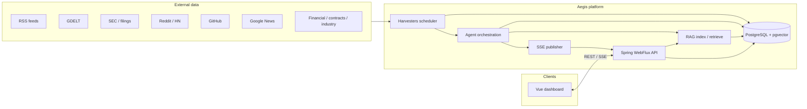
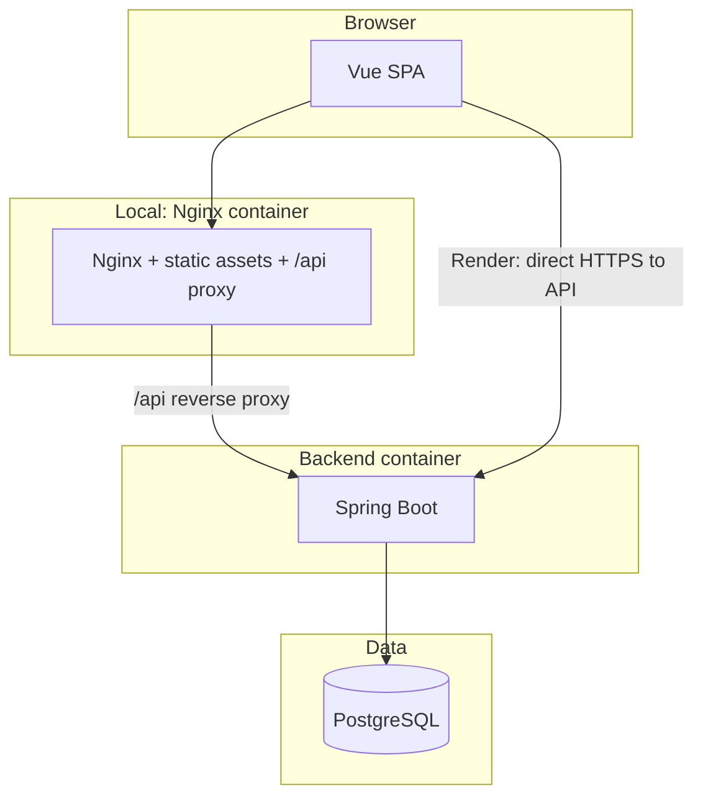
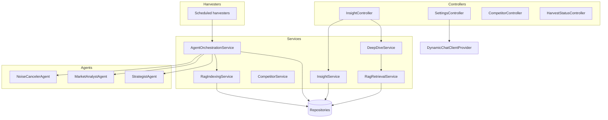
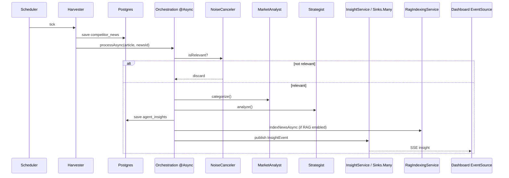
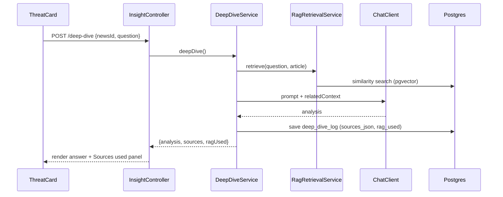
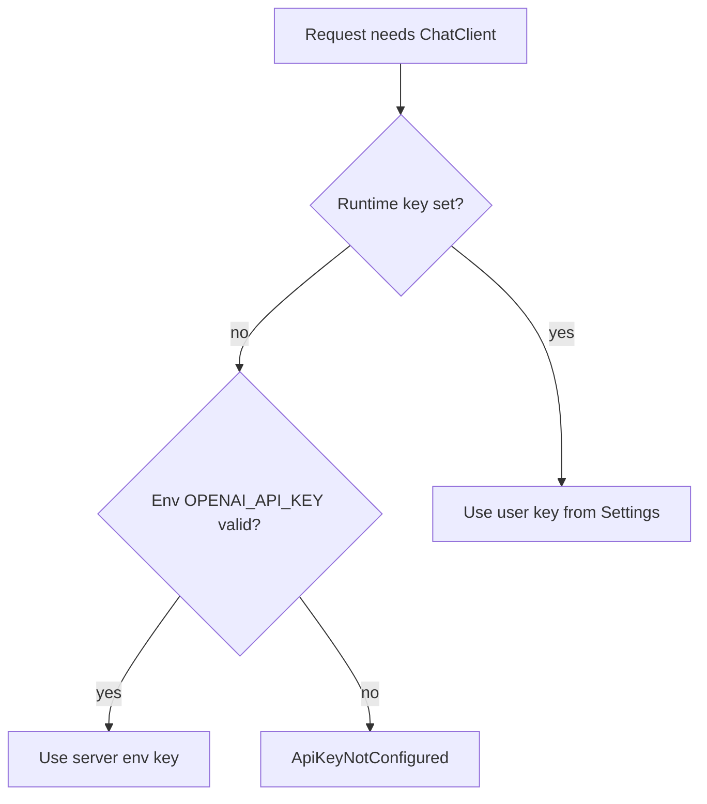
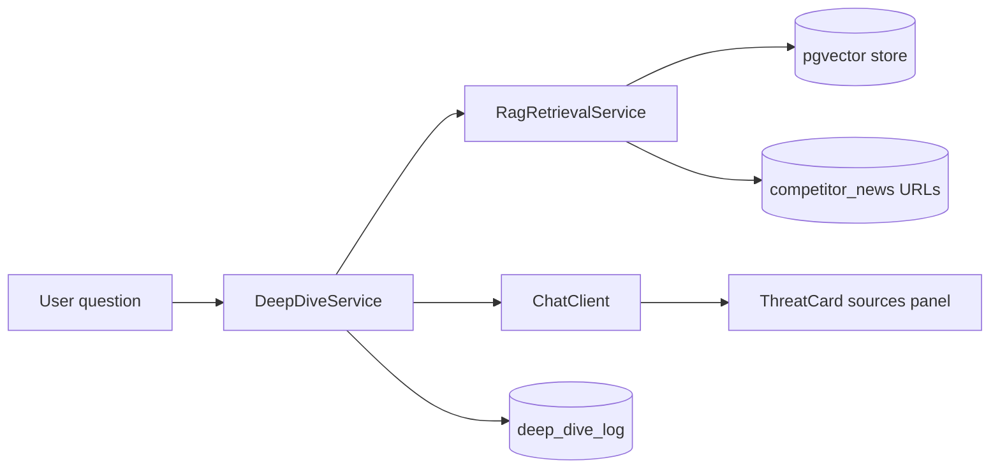
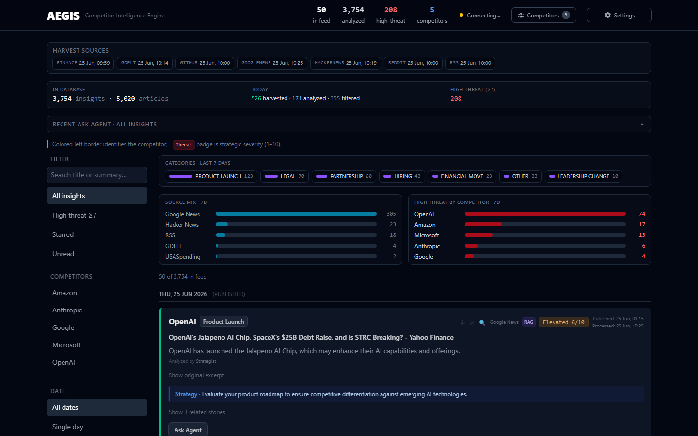
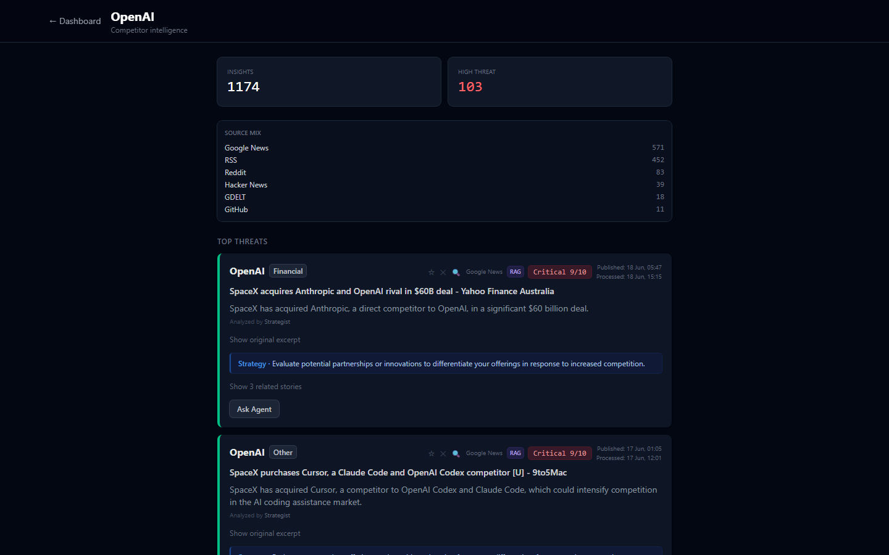
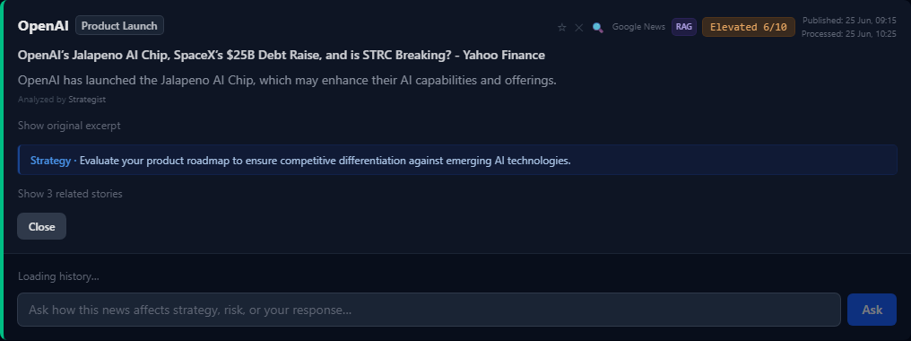

# Aegis Intelligence Engine

Real-time **competitor intelligence** platform: scheduled harvesters pull public market signals, a **three-stage Spring AI pipeline** filters and interprets them, and a **Vue 3** dashboard consumes insights via **Server-Sent Events (SSE)** and REST. **Ask Agent** deep-dives on any article; with **RAG** enabled (`pgvector`), answers cite the current story plus related harvested history.

---

## Table of contents

- [Problem and outcome](#problem-and-outcome)
- [Project scope](#project-scope)
- [What this project demonstrates](#what-this-project-demonstrates)
- [Tech stack](#tech-stack)
- [Architecture](#architecture)
- [Data and control flows](#data-and-control-flows)
- [Repository structure](#repository-structure)
- [Environment variables](#environment-variables)
- [Quick start](#quick-start)
- [API surface](#api-surface)
- [Ask Agent and RAG](#ask-agent-and-rag)
- [Screenshots](#screenshots)
- [Data model](#data-model)
- [Development and testing](#development-and-testing)
- [Operational notes](#operational-notes)
- [Deploy on Render](#deploy-on-render)
- [Future enhancements](#future-enhancements)

---

## Problem and outcome

**Problem:** Product, strategy, and marketing teams need a single place to watch **competitive moves** (launches, hiring, partnerships, filings) without drowning in raw feeds.

**Outcome:** Aegis **collects** heterogeneous sources into one schema, **reduces noise** with an LLM gate, **classifies and scores** threat, **streams** results so operators see high-signal updates as they land, and surfaces them in a **paginated, filterable dashboard** with honest DB counts—plus **Ask Agent** strategic Q&A on any item, with optional **RAG** grounding and cited sources.

---

## Project scope

### In scope

| Area | Description |
|------|-------------|
| **Ingestion** | Scheduled harvesters (RSS, GDELT, Reddit, Hacker News, SEC EDAR/EDGAR-style search, GitHub, Google News, financial/contract/industry feeds per `application.yml`). |
| **Persistence** | Raw articles in PostgreSQL (`pgvector` for RAG); Flyway-managed schema (V1–V6). |
| **AI pipeline** | Noise canceler → market analyst (category) → strategist (threat 1–10 + advice); failures never break the chain. |
| **Realtime UX** | SSE insight stream + paginated REST feed (`/feed`, `/stats`, `/analytics`), filters, competitor drill-down, harvest status, settings. |
| **Ask Agent + RAG** | Per-article deep-dive Q&A with pgvector retrieval over harvested news; cited sources in API + UI. |
| **Configuration** | Env-based DB, OpenAI key (server + optional user override in UI), tracked competitors, RAG feature flags. |
| **Local run** | Docker Compose (Postgres + API + Nginx SPA). |
| **Cloud run** | Render blueprint (`render.yaml`): API + static site; **Neon** for Postgres. |

### Out of scope (current release)

| Area | Notes |
|------|--------|
| **Multi-tenant auth** | No built-in user accounts or RBAC; suitable for internal/single-team or demo. |
| **SLA / HA** | Single API instance; no horizontal scaling story in-repo. |
| **Source connectors as products** | New sources require code changes (harvester + config), not plug-in marketplace. |
| **Long-term secret store** | User BYOK keys are per-browser-session on the API (in-memory); optional browser storage. Server `OPENAI_API_KEY` is the durable default for harvest + demo. |

### Boundaries and assumptions

- **OpenAI** is the configured LLM provider (Spring AI); agents degrade safely if the key is missing.
- **RAG** is **off by default** (`AEGIS_RAG_ENABLED=false`); enable explicitly for Ask Agent retrieval and indexing.
- **CORS** is configurable via `AEGIS_CORS_ALLOWED_ORIGINS` — use your **exact** dashboard origin in production (not `*`).
- **Public demo:** hosted-key trial is bound to `X-Aegis-Session` + client IP; interactive endpoints are rate-limited. Competitor list mutations can be disabled via `AEGIS_COMPETITORS_MUTATIONS_ENABLED=false` (set in `render.yaml`).
- **Legal / ToS** of each external source are the operator’s responsibility; URLs and cadences live in configuration.

---

## What this project demonstrates

- Full-stack **Java 21 + Spring Boot 3.4 (WebFlux)** with **Vue 3 + Vite + TypeScript**
- **SSE-first** UI instead of polling-only dashboards
- **Agent-shaped** orchestration with isolated `@Service` agents and safe fallbacks
- **RAG over harvested news** — Spring AI `PgVectorStore`, chunking/embeddings, cited sources in API + UI
- **Honest at scale** — paginated feed with DB-backed totals, pipeline stats, and server-side search (title + summary)
- **Contract alignment**: Java records ↔ TypeScript interfaces
- **Infrastructure**: Docker Compose locally (`pgvector/pgvector:pg16`); **Blueprint** for Render + Neon (SPA rewrites for Vue Router)

---

## Tech stack

| Layer | Technology |
|-------|------------|
| Backend | Java 21, Spring Boot 3.4, WebFlux, Spring AI (OpenAI + embeddings), `@Async` orchestration |
| Data | PostgreSQL 16 + **pgvector**, Spring Data JPA, Flyway |
| RAG | Spring AI `PgVectorStore`, OpenAI embeddings, `RagIndexingService` / `RagRetrievalService` |
| Frontend | Vue 3 (`<script setup lang="ts">`), Vite, Pinia, Tailwind CSS |
| Realtime | `Flux<ServerSentEvent<T>>`, Pinia + `useSse.ts` (`EventSource`) |
| Local infra | Docker Compose, Nginx (frontend container proxies `/api` to backend) |
| Cloud | Render (`render.yaml`) + Neon Postgres |
| Testing | JUnit 5 + AssertJ + Mockito; Vitest; Playwright (e2e) |

---

## Architecture

### High-level system context



### Logical layers (deployment view)



*Locally,* the browser hits `localhost:3000`; Nginx forwards `/api` to the backend. *On Render,* the static site is a separate URL; `VITE_API_BASE_URL` points the browser at the API for REST and SSE.

### Component map (backend packages)



---

## Data and control flows

### End-to-end insight pipeline



### Ask Agent (optional RAG)



See [Ask Agent and RAG](#ask-agent-and-rag) for env flags, backfill, and UI details.

### User API key (server default vs override)



Users can **PUT** `/api/settings/openai-key` to override; **DELETE** `/api/settings/openai-key` reverts to the server key when one exists (`configured` / `serverKeyAvailable` in `/api/settings/status`).

---

## Repository structure

```text
.
├── backend/
│   ├── Dockerfile
│   ├── pom.xml
│   └── src/main/java/com/aegis/
│       ├── agent/           # AI stages (noise, analyst, strategist)
│       ├── config/          # CORS, WebClient, RagConfig, DynamicChatClientProvider
│       ├── controller/      # REST + SSE
│       ├── dto/             # Java records (API contracts, DeepDiveSource, etc.)
│       ├── entity/          # JPA entities
│       ├── harvester/       # Source-specific ingestion
│       ├── repository/
│       ├── service/         # Orchestration, insights, competitors, deep-dive, RAG
│       └── util/
│   └── src/main/resources/
│       ├── application.yml
│       ├── application-local.yml   # optional local profile (H2)
│       └── db/migration/             # Flyway V1–V6 (pgvector + RAG store)
├── frontend/
│   ├── Dockerfile
│   ├── nginx.conf
│   ├── public/_redirects      # SPA fallback (Render + static hosts)
│   ├── scripts/capture-readme-screenshots.mjs
│   └── src/
│       ├── components/        # ThreatCard, InsightFeed*, PipelineStatsBar, analytics panels
│       ├── composables/       # useSse.ts, useInsightFeed.ts, useFeedFilters.ts
│       ├── lib/               # insightLabels.ts, categoryLabels.ts
│       ├── stores/
│       ├── types/insight.ts
│       └── views/             # Dashboard, CompetitorView
├── docker-compose.yml         # postgres: pgvector/pgvector:pg16
├── docker-compose.override.yml.example  # optional local Postgres on 5434
├── docs/screenshots/        # README images (npm run screenshots)
├── render.yaml              # Render Blueprint
└── .env.example
```

---

## Environment variables

| Variable | Where | Purpose |
|----------|-------|---------|
| `POSTGRES_PASSWORD` | Docker Compose | DB password for local stack |
| `OPENAI_API_KEY` | `.env`, Render | Server default OpenAI key |
| `SPRING_AI_OPENAI_API_KEY` | optional | Alias fallback for Spring property |
| `TRACKED_COMPETITORS` | Docker Compose `.env` | Maps to `AEGIS_TRACKED_COMPETITORS` in the API container |
| `AEGIS_TRACKED_COMPETITORS` | Render `aegis-api` | Comma-separated competitors to harvest (e.g. `Google,Amazon,OpenAI`) |
| `DATABASE_URL` | Neon → Render `aegis-api` | Neon **pooled** `postgresql://…` URL. Mapped to JDBC via `RenderDatabaseEnvironmentPostProcessor`. |
| `SPRING_DATASOURCE_URL` | Render `aegis-api` | Alternative to `DATABASE_URL`: `jdbc:postgresql://…-pooler.….neon.tech/neondb?sslmode=require` |
| `SPRING_DATASOURCE_USERNAME` | Render `aegis-api` | Use with split JDBC URL (e.g. `neondb_owner`) |
| `SPRING_DATASOURCE_PASSWORD` | Render `aegis-api` | Neon role password (use with split JDBC URL) |
| `SPRING_DATASOURCE_HIKARI_MAXIMUM_POOL_SIZE` | Render `aegis-api` | Connection pool size (demo: `2`) |
| `AEGIS_SOURCES_GOOGLENEWS_CRON` | Render `aegis-api` | Spring 6-field cron (default hourly: `0 0 * * * *`) |
| `AEGIS_SOURCES_GDELT_CRON` | optional | e.g. `0 15 * * * *` (staggered hourly) |
| `AEGIS_SOURCES_HACKERNEWS_CRON` | optional | e.g. `0 30 * * * *` |
| `AEGIS_SOURCES_RSS_CRON` | optional | e.g. `0 0 */2 * * *` |
| `AEGIS_SOURCES_REDDIT_CRON` | optional | e.g. `0 30 */2 * * *` |
| `PORT` | Render / PaaS | HTTP listen port (`server.port`) |
| `AEGIS_CORS_ALLOWED_ORIGINS` | Render / prod | Comma-separated origin patterns for browser clients |
| `AEGIS_COMPETITORS_MUTATIONS_ENABLED` | Render / prod | `false` disables POST/DELETE competitors (Blueprint default) |
| `AEGIS_INTERACTIVE_MAX_PER_MINUTE` | Render / prod | Rate limit for Ask Agent + AI Lookup per session/IP (default `30`) |
| `AEGIS_DEMO_TRIAL_MINUTES` | optional | Hosted-key demo length (default `5`) |
| `AEGIS_DEMO_TRIAL_ENABLED` | optional | Set `false` to disable hosted-key trial locally |
| `AEGIS_RAG_ENABLED` | optional | Enable pgvector RAG for Ask Agent (default `false`; keep off on Neon free tier demo) |
| `AEGIS_RAG_BACKFILL_ON_STARTUP` | optional | Index existing articles on API startup (one-time; set `false` after backfill) |
| `VITE_API_BASE_URL` | Frontend **build** | Public API base URL (e.g. `https://aegis-api.onrender.com`) |

See `.env.example` for the canonical local template.

---

## Quick start

### Prerequisites

- **Docker Desktop** (recommended), or Java 21 + Node 20+ + PostgreSQL 16
- **OpenAI API key** (for AI stages); configurable in `.env` or app Settings

### 1) Configure environment

```bash
cp .env.example .env
```

Edit `.env`: set at least `POSTGRES_PASSWORD` and `OPENAI_API_KEY`. For RAG locally, also set `AEGIS_RAG_ENABLED=true` (optional one-time `AEGIS_RAG_BACKFILL_ON_STARTUP=true`).

### 2) Run full stack (Docker)

```bash
docker compose up --build
```

| Service | URL |
|---------|-----|
| Frontend | http://localhost:3000 |
| Backend | http://localhost:8080 |
| Postgres | localhost:5432 (or **5434** if using `docker-compose.override.yml` when 5432 is busy) |

**Port conflict:** If another Postgres uses 5432, copy `docker-compose.override.yml.example` to `docker-compose.override.yml` (gitignored) to bind Aegis Postgres on 5434.

### 3) Run without Docker

**Backend** (Postgres must be running and match `application.yml` defaults or env):

```bash
cd backend
mvn spring-boot:run
# or: ./mvnw spring-boot:run  (if wrapper present)
```

**Frontend:**

```bash
cd frontend
npm install
npm run dev
```

Vite dev server proxies `/api` to `http://localhost:8080` (see `vite.config.ts`).

---

## API surface

| Method | Endpoint | Purpose |
|--------|----------|---------|
| `GET` | `/api/insights/stream` | SSE stream of insights |
| `GET` | `/api/insights/feed` | Paginated feed (`competitor`, `category`, `minThreat`, `search`, `dateFrom`, `dateTo`, `sort`, `offset`, `limit`, `ids`) |
| `GET` | `/api/insights/stats` | DB totals + today harvested/analyzed/filtered |
| `GET` | `/api/insights/analytics?days=7` | Category/source mix + high-threat by competitor |
| `GET` | `/api/insights/competitor/{name}/summary` | Per-competitor breakdown |
| `GET` | `/api/insights/{newsId}/related` | Semantically related stories via RAG (per-card; requires `AEGIS_RAG_ENABLED`) |
| `GET` | `/api/insights/latest?limit=20` | Recent insights (per competitor cap) |
| `GET` | `/api/insights/threats?minLevel=7` | Paginated high-threat feed |
| `POST` | `/api/insights/deep-dive` | LLM deep-dive on a news item (returns analysis + cited sources) |
| `GET` | `/api/insights/deep-dive/history?newsId=` | Prior Ask Agent Q&A for that article |
| `GET` | `/api/insights/deep-dive/history/recent` | Last 30 Ask Agent queries across all articles |
| `GET` | `/api/settings/status` | OpenAI configuration flags |
| `PUT` | `/api/settings/openai-key` | Set runtime user key |
| `DELETE` | `/api/settings/openai-key` | Clear user key (revert to server key if set) |
| `GET` | `/actuator/health` | Liveness (Render / load balancers) |

Example deep-dive body:

```json
{
  "newsId": 123,
  "question": "What does this imply for enterprise pricing?"
}
```

Example deep-dive response:

```json
{
  "analysis": "Answer:\nOpenAI's move signals…\n\nStrategic implications:\n• …",
  "sources": [
    {
      "newsId": 123,
      "title": "Headline of current article",
      "excerpt": "First ~400 chars of body…",
      "sourceUrl": "https://…",
      "currentArticle": true
    },
    {
      "newsId": 456,
      "title": "Related prior story",
      "excerpt": "…",
      "sourceUrl": "https://…",
      "currentArticle": false
    }
  ],
  "ragUsed": true
}
```

Additional routes exist for competitors and harvest status—see `backend/.../controller/`.

### Threat scoring

| Score | UI tier | Meaning |
|-------|---------|---------|
| 9–10 | Critical | Existential / direct niche threat (Strategist LLM) |
| 7–8 | High | Matches **High threat ≥7** filter and API `minLevel=7` |
| 5–6 | Elevated | Monitor and plan |
| 1–4 | Low | Awareness only |

Post-processing floors: `LEGAL` ≥5, `PARTNERSHIP` ≥4, `EDGAR` source ≥5 (`ThreatLevelAdjuster`).

### Dashboard feed UX

- **Paginated feed** — `GET /api/insights/feed` with honest `total` / `hasMore`; SSE prepends new items.
- **Filters** — competitor, category, date (7d/30d/custom), search, sort, high-threat.
- **Similar headlines** — title-token clusters in the feed (`clusterKey`); not the same as per-card **RAG** related stories.
- **Read / star / dismiss** — stored in **browser localStorage** only; unread filter applies to the **loaded feed**, not the full DB.
- **Starred** — IDs from localStorage, items fetched via `GET /feed?ids=1,2,3`.
- **Competitor page** — `/competitor/:name` (SPA; `public/_redirects` + Render rewrite).
- **UI theme** — dark-only dashboard (no light mode or theme toggle).

Example feed response:

```json
{
  "items": [{ "id": 1, "threatLevel": 8, "clusterKey": null, "ragAvailable": true }],
  "total": 3721,
  "hasMore": true
}
```

Example stats response:

```json
{
  "totalArticles": 7276,
  "totalInsights": 1358,
  "filteredArticles": 5918,
  "todayHarvested": 495,
  "todayAnalyzed": 61,
  "todayFiltered": 434,
  "highThreatCount": 427
}
```

---

## Ask Agent and RAG

**Ask Agent** (per threat card) sends a strategic question about one harvested article. When `AEGIS_RAG_ENABLED=true`, the backend:

1. Embeds the question and searches **pgvector** (`aegis_rag_store`) for related chunks from the same competitor.
2. Injects retrieved context into the deep-dive prompt.
3. Returns structured **sources** (current article + related history) and `ragUsed: true` when retrieval contributed.



**UI behavior**

- **Sources used (n)** — collapsible list with *This article* vs *Related* labels and clickable `sourceUrl` links.
- **RAG** badge when vector retrieval contributed.
- **Previous asks** — clickable history per article; restores full answer, sources, and question text.

**Indexing**

- New insights are indexed asynchronously after the agent pipeline (`RagIndexingService`).
- One-time backfill: set `AEGIS_RAG_BACKFILL_ON_STARTUP=true`, wait for completion, then set back to `false` (avoids re-indexing on every deploy).
- Local Docker uses `pgvector/pgvector:pg16`; production uses Neon with the `vector` extension (Flyway **V5**).

**Flyway**

| Version | Migration |
|---------|-----------|
| V5 | `vector` extension + `aegis_rag_store` |
| V6 | `deep_dive_log.sources_json`, `deep_dive_log.rag_used` |

---

## Screenshots

### Dashboard

Paginated competitor feed with **honest DB counts**, sidebar filters (search, high-threat, starred, date range), pipeline stats, analytics panel, and **Ask Agent** on each card. Search runs server-side against article titles and AI summaries (~350ms debounce).



### Competitor drill-down

Per-competitor summary (category/source mix, high-threat count) and threat-sorted insight list at `/competitor/:name`.



### Ask Agent with RAG sources and history

Click **Ask Agent** on any threat card. Prior questions are selectable; the full answer and **Sources used** panel restore from `deep_dive_log`. Per-card **semantically related (RAG)** stories are separate from feed **similar headlines** clusters.



*Refresh after UI changes (Docker stack at `localhost:3000`, API at `localhost:8080`):*

```bash
cd frontend && npm run screenshots
```

---

## Data model

| Table | Role |
|-------|------|
| `competitor_news` | Normalized raw harvest rows |
| `agent_insights` | AI output linked to `competitor_news` |
| `deep_dive_log` | Ask Agent history (`question`, `analysis`, `sources_json`, `rag_used`) |
| `aegis_rag_store` | pgvector embeddings for RAG (Spring AI `PgVectorStore`) |

Migrations: `backend/src/main/resources/db/migration/` (V1–V6).

---

## Development and testing

```bash
# Backend
cd backend && mvn test

# Frontend unit + typecheck
cd frontend && npm run build && npm run test

# Frontend e2e (Playwright; starts vite preview)
cd frontend && npm run test:e2e

# Refresh README screenshots (Docker stack running)
cd frontend && npm run screenshots
```

A `.github/workflows/ci.yml` workflow is included locally for optional GitHub Actions (requires `workflow` OAuth scope to push).

---

## Operational notes

- Compose orders **backend after Postgres healthy** to avoid Flyway races.
- Harvesters **self-heal**: bad upstream keys or HTTP errors are logged; the next cron tick retries.
- **SSE** delivery uses a central reactive sink (`Sinks.Many`) as the hot path after persistence.
- **RAG indexing** runs async after each insight; backfill is sequential to protect the DB pool—disable `AEGIS_RAG_BACKFILL_ON_STARTUP` after the first full index.
- **Free Render** tiers may spin down the API—scheduled harvests and long-lived SSE pause until the service wakes.
- **Neon free tier (100 CU-hrs/mo):** use pooled connection string, `SPRING_DATASOURCE_HIKARI_MAXIMUM_POOL_SIZE=2`, slower harvest crons (see `render.yaml`), `AEGIS_RAG_ENABLED=false`, and **suspend `aegis-api`** when not demoing. Header stat **“competitors”** counts distinct names in the **loaded feed** (historical rows), not `AEGIS_TRACKED_COMPETITORS`.

---

## Deploy on Render (with Neon)

**Database:** [Neon](https://neon.tech) Postgres (free tier is fine). **Apps:** Render via **`render.yaml`** (no Render Postgres — avoids the one-free-DB-per-account limit).

| Resource | Where | Role |
|----------|--------|------|
| Postgres | **Neon** project (e.g. `aegis-db`) | Data storage; Flyway runs on API startup |
| Web Service | Render `aegis-api` | Docker image from `backend/` |
| Static Site | Render `aegis-dashboard` | Vue build → `dist` |

### Steps

1. **Neon:** Create a project → copy **pooled** connection string → keep secret (never commit).
2. **GitHub:** Push this repo.
3. **Render:** **New** → **Blueprint** → select repo.
4. When prompted, set secrets in the Render dashboard (Blueprint defaults in `render.yaml` cover the rest):
   - **Database (pick one):**
     - **`DATABASE_URL`** — Neon **pooled** connection string (`…-pooler.….neon.tech/…`), **or**
     - **`SPRING_DATASOURCE_URL`** + **`SPRING_DATASOURCE_USERNAME`** + **`SPRING_DATASOURCE_PASSWORD`** — JDBC URL without embedded password (reliable on Render)
   - **`OPENAI_API_KEY`** — team default OpenAI key (set a billing cap in OpenAI)
   - **`AEGIS_RAG_ENABLED`** — leave `false` for demo (saves Neon compute); `true` only if you need related-story RAG
   - **`AEGIS_RAG_BACKFILL_ON_STARTUP`** — `false` unless doing a one-time index
5. Confirm blueprint values match your dashboard URL in **`AEGIS_CORS_ALLOWED_ORIGINS`** (e.g. `https://aegis-dashboard-c4vm.onrender.com`).
6. Wait for deploy (first API Docker build may take several minutes).
7. Open the **`aegis-dashboard`** static site URL (not the API hostname); optional Settings override for OpenAI key.
8. **SPA routing:** the static site ships `public/_redirects` and `render.yaml` includes a `/* → /index.html` rewrite so `/competitor/:name` works on refresh.

### URLs and CORS

Render deploys **two public URLs** — do not open the API root in a browser expecting the UI.

| Service | Live example | Use |
|---------|----------------|-----|
| **Dashboard (UI)** | `https://aegis-dashboard-c4vm.onrender.com` | Open this in the browser |
| **API (JSON/SSE)** | `https://aegis-api-vu7l.onrender.com` | REST + SSE only |

- The API has **no homepage**. Visiting the API root returns Spring’s **404 Whitelabel page** — that is normal, not a crash.
- Health check: `GET /actuator/health` → `{"status":"UP",...}`
- Smoke test: `GET /api/insights/stats`

Set `AEGIS_CORS_ALLOWED_ORIGINS` to your **exact** dashboard URL (committed in `render.yaml` for the reference deploy).

### API keys on Render

- **Server:** `OPENAI_API_KEY` on `aegis-api` (harvest pipeline + hosted demo).
- **User BYOK:** Settings sends key with `X-Aegis-Session`; stored **per session** on the API (not global). DELETE clears only that session’s override.

---

## Future enhancements

| Idea | Benefit |
|------|---------|
| **Cross-competitor RAG** | Retrieve related context across all tracked competitors, not just the current article’s competitor. |
| **AuthN / multi-tenant** | Per-tenant competitor lists and insight isolation; OAuth2 or API keys for B2B. |
| **Synced read/star state** | Server-backed bookmarks and read receipts (today: browser localStorage only). |
| **Full-text search** | Search article body and Ask Agent history, not just title + summary. |
| **Job queue** | Move heavy harvest + agent work off the web thread entirely (e.g. Redis/SQS) for burst handling. |
| **Observability** | Structured logging correlation IDs, metrics (Micrometer + Prometheus), tracing (OpenTelemetry). |
| **Connector SDK** | Declarative source config (YAML) with shared `HarvesterSupport` patterns to add feeds without a new class each time. |
| **Alerting** | Webhooks or email when `threatLevel` crosses thresholds or for specific categories. |
| **Data retention** | Scheduled archival/cleanup for large Neon datasets. |

---

## Why this project matters

Raw feeds are cheap; **decisions** are expensive. Aegis compresses signal by combining durable storage, **structured LLM stages**, a **live** UI, and **cited Ask Agent answers** grounded in your own harvested corpus—so teams react to competitor moves with context, not noise.

---

## License and contributing

Add a `LICENSE` and contribution guidelines if you open-source the repo; align with your organization’s policy.
